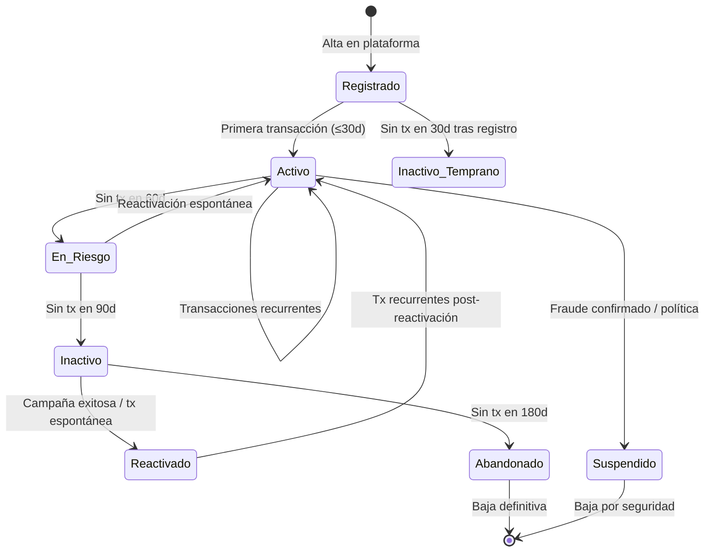
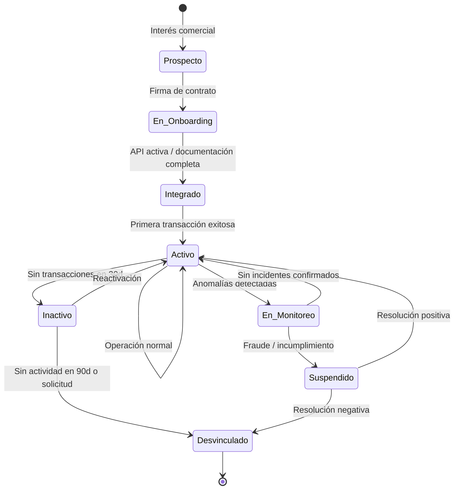
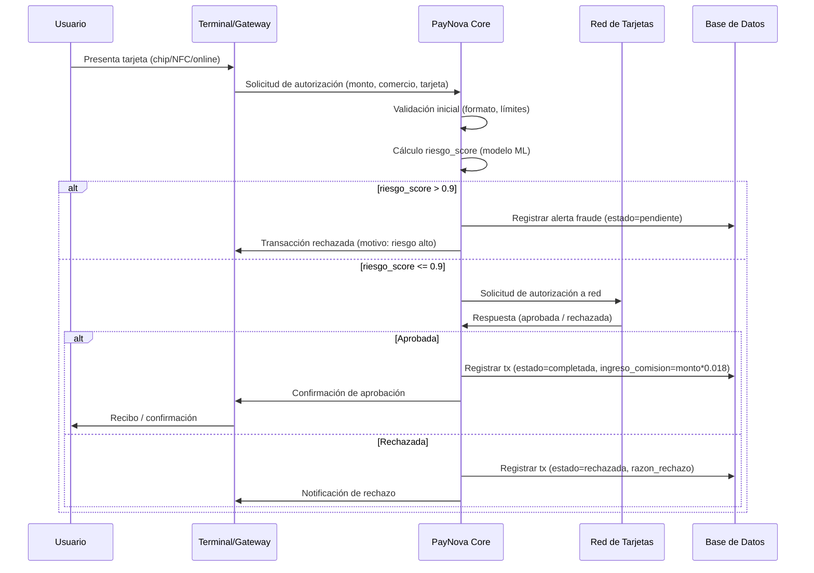
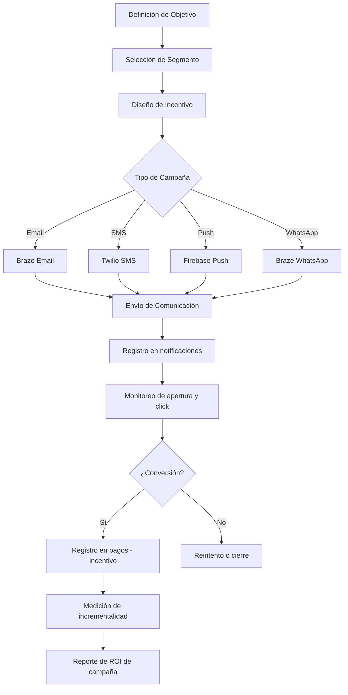
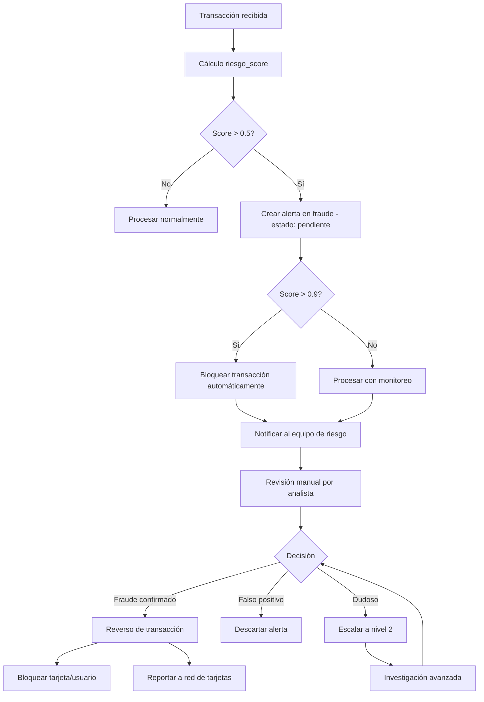
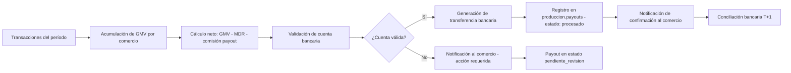

# Documento 02 — Arquitectura Operativa
## PayNova S.A. — Modelo Operativo Completo

**Versión:** 1.0  
**Referencias cruzadas:** `01_business_overview.md`, `03_business_conceptual_model.md`, `07_business_rules.md`

---

## 1. Ciclo de Vida del Usuario

### 1.1 Estados del Usuario



### 1.2 Definición de Estados

| Estado | Definición | Campo en BD |
|--------|------------|-------------|
| **Registrado** | Usuario creó cuenta pero no ha realizado ninguna transacción | `usuarios.estado = 'activo'` + `score_actividad = 0` |
| **Activo** | Realizó al menos 1 transacción en los últimos 30 días | `usuarios.estado = 'activo'` + última tx ≤ 30d |
| **En Riesgo** | Sin transacciones entre 31 y 89 días | Calculado sobre `transacciones.fecha_transaccion` |
| **Inactivo** | Sin transacciones entre 90 y 179 días | Calculado sobre `transacciones.fecha_transaccion` |
| **Reactivado** | Realizó al menos 1 transacción después de haber sido inactivo ≥ 90 días | Calculado por lógica ETL |
| **Abandonado** | Sin transacciones en 180+ días | Calculado sobre `transacciones.fecha_transaccion` |
| **Suspendido** | Cuenta bloqueada por política de riesgo o fraude confirmado | `usuarios.estado = 'suspendido'` o `'bloqueado'` |

### 1.3 Eventos Relevantes del Ciclo de Vida del Usuario

| Evento | Descripción | Acción del sistema |
|--------|-------------|-------------------|
| **Registro** | El usuario completa el alta en la plataforma | Crear registro en `produccion.usuarios` |
| **Primera Transacción** | Primer pago exitoso | Actualizar `fecha_registro`, incrementar `score_actividad` |
| **Transacción Recurrente** | Pago subsecuente | Recalcular `score_actividad` y `score_rentabilidad` |
| **Umbral de Inactividad 30d** | Sin actividad 30 días desde registro | Disparar campaña de activación |
| **Umbral de Inactividad 60d** | Sin actividad 60 días desde última tx | Cambiar estado a "En Riesgo", disparar campaña |
| **Umbral de Inactividad 90d** | Sin actividad 90 días | Cambiar estado a "Inactivo", campaña de reactivación |
| **Reactivación** | Primera tx después de inactividad ≥ 90d | Registrar en segmentación como reactivado |
| **Alerta de Fraude** | Score de riesgo > 0.7 en transacción | Crear alerta en `produccion.fraude` |
| **Fraude Confirmado** | Revisión manual confirma fraude | Suspender usuario, reverso de transacción |

### 1.4 KPIs del Ciclo de Vida del Usuario

| KPI | Fórmula | Objetivo |
|-----|---------|---------|
| Tasa de Activación (30d) | Usuarios con 1+ tx en 30d / Total registrados en período | > 60% |
| Tasa de Retención (90d) | Usuarios activos mes actual que también lo fueron hace 90d / Total activos hace 90d | > 70% |
| Tasa de Churn Mensual | Usuarios que pasan a inactivo en mes / Usuarios activos inicio de mes | < 5% |
| Tasa de Reactivación | Reactivados en mes / Total inactivos al inicio del mes | > 8% |
| Tiempo Promedio a Primera Tx | Días entre registro y primera transacción | < 7 días |

---

## 2. Ciclo de Vida del Comercio

### 2.1 Estados del Comercio



### 2.2 Etapas del Onboarding

```
ETAPA 1: PROSPECCIÓN
  └── Contacto comercial → Presentación → Negociación de condiciones

ETAPA 2: FIRMA Y DOCUMENTACIÓN
  └── Firma de contrato → KYB (Know Your Business) → Validación legal

ETAPA 3: CONFIGURACIÓN TÉCNICA
  └── Entrega de API key → Configuración de webhook → Credenciales de sandbox

ETAPA 4: INTEGRACIÓN DE NOTIFICACIONES
  └── Activación de email comercial → Activación de SMS → Configuración de plantillas

ETAPA 5: PRUEBAS
  └── Transacciones en entorno de prueba → Validación de webhooks → Aprobación técnica

ETAPA 6: ACTIVACIÓN EN PRODUCCIÓN
  └── Habilitación en producción → Primera transacción real → Comercio = ACTIVO

ETAPA 7: SEGUIMIENTO POST-ACTIVACIÓN
  └── Revisión de KPIs semana 1 → Ajustes → Asignación de Account Manager
```

### 2.3 Segmentación de Comercios

| Segmento de Volumen | Criterio (GMV mensual) | Ejemplos |
|--------------------|----------------------|---------|
| **Micro** | < $10,000 | Tienda barrio, food truck |
| **Pequeño** | $10,000 – $50,000 | Restaurante local, farmacia independiente |
| **Mediano** | $50,000 – $200,000 | Cadena regional, e-commerce pequeño |
| **Grande** | $200,000 – $1,000,000 | Retail regional, hotel boutique |
| **Mega** | > $1,000,000 | Supermercado cadena, aerolínea |

| Segmento de Rentabilidad | Criterio (MDR neto generado) |
|--------------------------|------------------------------|
| **Bronze** | MDR mensual < $500 |
| **Silver** | MDR mensual $500 – $2,000 |
| **Gold** | MDR mensual $2,000 – $8,000 |
| **Platinum** | MDR mensual $8,000 – $25,000 |
| **Diamond** | MDR mensual > $25,000 |

### 2.4 KPIs del Ciclo de Vida del Comercio

| KPI | Fórmula | Objetivo |
|-----|---------|---------|
| Tiempo de Activación | Días desde firma hasta primera tx | < 5 días hábiles |
| Tasa de Integración | Comercios activos / Comercios con contrato firmado | > 85% |
| Tasa de Retención Anual | Comercios activos año actual / Comercios activos año anterior | > 95% |
| GMV por Comercio | GMV total / Comercios activos | Benchmark por segmento |
| MDR por Comercio | MDR total / Comercios activos | Benchmark por segmento |

---

## 3. Flujo Transaccional Completo

### 3.1 Tipos de Transacción

| Tipo | Descripción | Genera MDR |
|------|-------------|------------|
| **compra** | Pago de bienes o servicios en comercio | Sí |
| **retiro** | Extracción de efectivo en ATM | Sí (tarifa diferente) |
| **transferencia** | Movimiento de fondos entre cuentas | No (fuera del modelo MDR) |
| **pago_servicio** | Pago de facturas, servicios públicos | Sí |
| **recarga** | Recarga de saldo prepago | Sí |
| **devolucion** | Reverso de compra por el comercio | Negativo (revierte MDR) |
| **ajuste** | Corrección administrativa | No |

### 3.2 Canales de Transacción

| Canal | Descripción | Código en BD |
|-------|-------------|--------------|
| **Chip** | Tarjeta con chip EMV en terminal físico | `chip` |
| **Banda Magnética** | Tarjeta con banda en terminal físico | `banda_magnetica` |
| **Online** | Pago digital sin tarjeta presente | `online` |
| **NFC** | Pago sin contacto (tap) | `nfc` |
| **ATM** | Cajero automático | `atm` |
| **Transferencia** | Transferencia bancaria directa | `transferencia` |
| **Otro** | Canales alternativos | `otro` |

### 3.3 Estados de Transacción

| Estado | Descripción | Es final |
|--------|-------------|---------|
| **completada** | Transacción aprobada y procesada exitosamente | Sí |
| **pendiente** | En proceso de autorización | No |
| **rechazada** | Denegada por la red o por PayNova | Sí |
| **revertida** | Fue completada pero luego revertida (chargeback) | Sí |
| **error** | Falla técnica durante el procesamiento | Sí |

### 3.4 Flujo Detallado de una Transacción



### 3.5 Razones de Rechazo Más Comunes

| Código | Razón | Frecuencia típica |
|--------|-------|------------------|
| `fondos_insuficientes` | Saldo insuficiente en cuenta | ~35% de rechazos |
| `tarjeta_bloqueada` | Tarjeta suspendida por el emisor | ~20% |
| `limite_excedido` | Supera límite de crédito | ~18% |
| `fraude_sospechoso` | Score de riesgo elevado | ~12% |
| `error_tecnico` | Falla de comunicación | ~8% |
| `datos_invalidos` | Información incorrecta (CVV, fecha) | ~7% |

---

## 4. Flujo de Campañas de Marketing



### 4.1 Tipos de Incentivo

| Tipo | Descripción | Ejemplo |
|------|-------------|---------|
| **Cashback** | Devolución de porcentaje del monto | 5% en primera compra |
| **Descuento Directo** | Reducción del monto a pagar | $50 de descuento en compra > $300 |
| **Puntos** | Acumulación de puntos canjeables | 2 puntos por $1 gastado |
| **Bono de Activación** | Premio por primera transacción | $100 al primer pago |
| **Bono de Reactivación** | Premio al volver a usar la app | $50 después de 90d inactivo |

### 4.2 Atribución de Campañas

**Regla de atribución por defecto:** Last-touch (última interacción antes de la conversión)

- Ventana de atribución: 72 horas desde el último clic o apertura
- Si el usuario convierte sin haber abierto ninguna comunicación en la ventana → conversión orgánica
- Conversiones orgánicas no se atribuyen a ninguna campaña

---

## 5. Flujo de Comunicaciones

### 5.1 Casos de Uso por Canal

| Canal | Caso de Uso | Costo unitario estimado |
|-------|-------------|------------------------|
| **Email** | Confirmación de transacción, estado de payout, campañas, resumen mensual | $0.001 |
| **SMS** | OTP, alertas críticas, confirmación de pago en canales de riesgo | $0.05 |
| **Push** | Notificaciones en app, recordatorios, alertas | $0.0001 |
| **WhatsApp** | Atención al cliente, notificaciones premium | $0.03 |
| **Webhook** | Integración técnica con sistemas del comercio | $0.0005 |

### 5.2 Métricas de Comunicaciones

| Métrica | Definición | Benchmark interno |
|---------|------------|-------------------|
| **Delivery Rate** | Mensajes entregados / Mensajes enviados | > 95% |
| **Open Rate** | Emails abiertos / Emails entregados | > 25% |
| **Click Rate** | Clics / Emails abiertos | > 8% |
| **Conversion Rate** | Conversiones / Mensajes enviados | > 3% |
| **Opt-out Rate** | Desuscripciones / Mensajes enviados | < 0.5% |

---

## 6. Flujo de Gestión de Fraude



### 6.1 Niveles de Alerta

| Nivel | Score de Riesgo | Acción Automática | SLA de Revisión |
|-------|----------------|-------------------|----------------|
| **Verde** | 0.00 – 0.30 | Ninguna | No aplica |
| **Amarillo** | 0.31 – 0.50 | Monitoreo pasivo | 48 horas |
| **Naranja** | 0.51 – 0.70 | Alerta creada | 24 horas |
| **Rojo** | 0.71 – 0.90 | Alerta prioritaria | 4 horas |
| **Crítico** | 0.91 – 1.00 | Bloqueo automático | 1 hora |

### 6.2 Tipos de Alerta de Fraude

| Tipo | Descripción | Score típico |
|------|-------------|-------------|
| `monto_inusual` | Monto muy superior al ticket promedio del usuario | 0.6 – 0.8 |
| `ubicacion_anomala` | Transacción en ciudad/país diferente a patrón habitual | 0.5 – 0.7 |
| `frecuencia_alta` | Múltiples transacciones en ventana de tiempo corta | 0.7 – 0.9 |
| `patron_sospechoso` | Secuencia de montos que sugiere prueba de tarjeta | 0.8 – 0.95 |
| `tarjeta_clonada` | Indicadores de uso simultáneo de la misma tarjeta | 0.9 – 1.0 |
| `identidad_robada` | Discrepancia entre comportamiento histórico y actual | 0.85 – 1.0 |

---

## 7. Flujo de Liquidaciones (Payouts)



### 7.1 Elegibilidad para Liquidación

Un comercio es elegible para recibir un payout si cumple **todas** las siguientes condiciones:

1. `status_operacional = 'activo'`
2. `estado_integracion = 'activa'` en `integraciones_merchant`
3. Cuenta bancaria validada y activa
4. Sin alertas de fraude activas de nivel "Crítico" en el período
5. GMV acumulado en el período > $0
6. No se encuentra en proceso de investigación de riesgo

### 7.2 Cálculo del Monto de Payout

```
Monto Payout Bruto = SUM(transacciones.monto) donde estado = 'completada' en el período
MDR Retenido       = SUM(transacciones.ingreso_comision) en el período
Comisión Payout    = Monto Bruto * tasa_comision_payout (varía por segmento)
Monto Neto Payout  = Monto Payout Bruto - MDR Retenido - Comisión Payout
```

| Segmento | Tasa comisión payout |
|----------|---------------------|
| Micro | 0.5% |
| Pequeño | 0.4% |
| Mediano | 0.3% |
| Grande | 0.2% |
| Mega | 0.1% |
