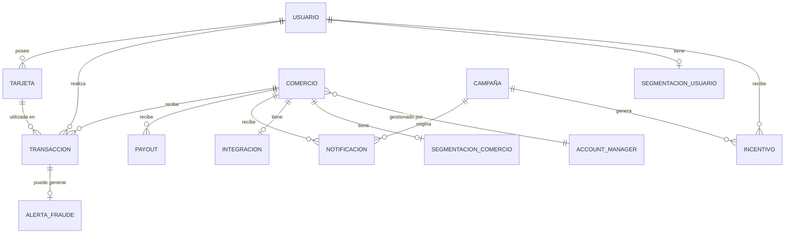

# Documento 03 — Modelo Conceptual Empresarial
## PayNova S.A. — Entidades, Relaciones y Jerarquías

**Versión:** 1.0  
**Referencias cruzadas:** `04_data_dictionary.md`, `05_business_ontology.md`, `07_business_rules.md`

---

## 1. Entidades Principales

### 1.1 Usuario
**Descripción:** Persona física o jurídica que utiliza la plataforma PayNova para realizar pagos mediante tarjeta.

**Atributos clave:**
- Identificador único interno y externo (IBM origin)
- Estado del ciclo de vida (activo / inactivo / suspendido / bloqueado)
- Tipo de usuario (individual / empresarial / premium / básico)
- Nivel de riesgo (bajo / medio / alto / crítico)
- Score de actividad (0–100): frecuencia transaccional normalizada
- Score de rentabilidad (0–100): volumen monetario normalizado
- Ciudad y país de operación principal

**Tabla:** `produccion.usuarios`

---

### 1.2 Comercio (Merchant)
**Descripción:** Empresa o persona que acepta pagos a través de la plataforma PayNova y recibe liquidaciones periódicas por las transacciones acumuladas.

**Atributos clave:**
- Identificador único y código de origen IBM
- Categoría derivada del MCC (Merchant Category Code)
- Segmento de volumen (micro / pequeño / mediano / grande / mega)
- Segmento de rentabilidad (bronze / silver / gold / platinum / diamond)
- Estado operacional (activo / inactivo / suspendido)
- Coordinador asignado (Account Manager)
- Fecha de afiliación y última actividad

**Tabla:** `produccion.merchants`, `produccion.segmentacion_merchants`

---

### 1.3 Transacción
**Descripción:** Operación financiera atómica donde un usuario realiza un pago a un comercio a través de la plataforma. Es la entidad central del negocio.

**Atributos clave:**
- Monto bruto
- Tipo (compra / retiro / transferencia / etc.)
- Canal (chip / online / NFC / etc.)
- Estado (completada / rechazada / revertida / error)
- Ingreso de comisión (MDR: 1.8% del monto)
- Costo operativo (0.8% del monto)
- Margen generado (1.0% del monto, calculado automáticamente)
- Score de riesgo (0–1)
- Timestamp completo + derivados (hora, día semana, mes)

**Tabla:** `transacciones.transacciones`

---

### 1.4 Tarjeta
**Descripción:** Instrumento de pago asociado a un usuario que habilita la realización de transacciones.

**Atributos clave:**
- Tipo (débito / crédito / prepago / virtual)
- Marca (Visa / Mastercard / Amex / Discover)
- Estado (activa / bloqueada / cancelada / vencida)
- Score de uso (0–100)

**Tabla:** `produccion.tarjetas`

---

### 1.5 Payout (Liquidación)
**Descripción:** Desembolso periódico que PayNova realiza a un comercio, representando el monto neto de sus transacciones del período menos comisiones y costos.

**Atributos clave:**
- Monto bruto del desembolso
- Comisión de payout
- Monto neto (calculado automáticamente)
- Estado (procesado / pendiente / rechazado / revertido)
- Razón de rechazo (si aplica)
- Período que cubre (desde / hasta)
- Método de pago (transferencia bancaria / etc.)

**Tabla:** `produccion.payouts`

---

### 1.6 Notificación
**Descripción:** Comunicación enviada a un comercio a través de uno o más canales digitales, ya sea de carácter operativo (confirmación de pago, estado de payout) o promocional (campaña de marketing).

**Atributos clave:**
- Canal (email / sms / push / whatsapp / webhook)
- Cantidad de mensajes enviados en el lote
- Costo unitario y costo total
- Estado de entrega
- Tasa de apertura y click (para email)

**Tabla:** `produccion.notificaciones`

---

### 1.7 Campaña
**Descripción:** Iniciativa de marketing con un objetivo, segmento objetivo, incentivo y período de ejecución definidos.

**Atributos clave:**
- Tipo de campaña (email / sms / push / whatsapp / mixta / inapp)
- Segmento objetivo
- Presupuesto asignado
- Estado (planificada / activa / pausada / finalizada / cancelada)
- Fechas de inicio y fin

**Tabla:** `produccion.campanas`

---

### 1.8 Alerta de Fraude
**Descripción:** Registro generado automáticamente por el sistema de detección de fraude cuando una transacción supera el umbral de riesgo definido.

**Atributos clave:**
- Score de fraude (0–1)
- Tipo de alerta (monto_inusual / ubicacion_anomala / etc.)
- Modelo detector utilizado
- Estado de revisión (pendiente / en_revision / confirmado / descartado / escalado)
- Fecha de detección

**Tabla:** `produccion.fraude`

---

### 1.9 Account Manager (Gestor Comercial)
**Descripción:** Profesional interno de PayNova responsable de gestionar y desarrollar la relación con un portafolio de comercios asignados.

**Atributos clave:**
- Nombre y email corporativo
- Estado (activo / inactivo)
- Región de responsabilidad

**Tabla:** `produccion.account_managers`

---

### 1.10 Integración de Comercio
**Descripción:** Registro del estado del proceso de onboarding e integración técnica de un comercio con la plataforma PayNova.

**Atributos clave:**
- Estado de integración (no_iniciada / en_curso / activa / pausada / suspendida)
- Canales integrados (email / SMS / webhook / API key)
- Fechas de inicio y completación
- Coordinador responsable del onboarding

**Tabla:** `produccion.integraciones_merchant`

---

### 1.11 Segmentación
**Descripción:** Clasificación multidimensional asignada a usuarios y comercios mediante algoritmos de Machine Learning (K-Means) y reglas de negocio.

**Tablas:** `produccion.segmentacion` (usuarios), `produccion.segmentacion_merchants` (comercios)

---

## 2. Relaciones entre Entidades

### 2.1 Diagrama de Relaciones de Negocio



### 2.2 Tabla de Relaciones con Cardinalidad

| Entidad A | Relación | Entidad B | Cardinalidad | Regla de negocio |
|-----------|----------|-----------|-------------|-----------------|
| Usuario | realiza | Transacción | 1:N | Un usuario puede realizar múltiples transacciones |
| Comercio | recibe | Transacción | 1:N | Un comercio puede recibir múltiples transacciones |
| Tarjeta | utilizada en | Transacción | 1:N | Una tarjeta puede usarse en múltiples transacciones |
| Usuario | posee | Tarjeta | 1:N | Un usuario puede tener múltiples tarjetas |
| Transacción | genera | Alerta de Fraude | 1:0..1 | Una transacción puede generar cero o una alerta |
| Comercio | recibe | Payout | 1:N | Un comercio recibe múltiples payouts a lo largo del tiempo |
| Comercio | tiene | Integración | 1:1 | Cada comercio tiene exactamente un registro de integración |
| Comercio | tiene | Segmentación | 1:1 | Cada comercio tiene un registro de segmentación activo |
| Account Manager | gestiona | Comercio | 1:N | Un manager puede gestionar múltiples comercios |
| Campaña | origina | Notificación | 1:N | Una campaña puede generar múltiples envíos |
| Campaña | genera | Incentivo | 1:N | Una campaña puede tener múltiples incentivos |
| Usuario | recibe | Incentivo | 1:N | Un usuario puede recibir incentivos de múltiples campañas |

---

## 3. Jerarquías

### 3.1 Jerarquía de Segmentos de Usuario

```
USUARIOS
├── Por Actividad
│   ├── Alto Volumen     (> P75 de transacciones)
│   ├── Frecuente        (P50–P75)
│   ├── Esporádico       (P25–P50)
│   └── Inactivo         (< P25 o sin tx en 90d)
│
├── Por Rentabilidad
│   ├── Platinum         (score_rentabilidad > 80)
│   ├── Gold             (score_rentabilidad 60–80)
│   ├── Silver           (score_rentabilidad 40–60)
│   └── Bronze           (score_rentabilidad < 40)
│
└── Por Riesgo
    ├── Bajo             (pct_fraude < 1%)
    ├── Medio            (pct_fraude 1%–5%)
    ├── Alto             (pct_fraude 5%–15%)
    └── Crítico          (pct_fraude ≥ 15%)
```

### 3.2 Jerarquía de Segmentos de Comercio

```
COMERCIOS
├── Por Volumen (GMV mensual)
│   ├── Mega             (> $1,000,000)
│   ├── Grande           ($200,000 – $1,000,000)
│   ├── Mediano          ($50,000 – $200,000)
│   ├── Pequeño          ($10,000 – $50,000)
│   └── Micro            (< $10,000)
│
├── Por Rentabilidad (MDR mensual neto)
│   ├── Diamond          (> $25,000)
│   ├── Platinum         ($8,000 – $25,000)
│   ├── Gold             ($2,000 – $8,000)
│   ├── Silver           ($500 – $2,000)
│   └── Bronze           (< $500)
│
├── Por Riesgo
│   ├── Monitoreado      (alerta activa, sin confirmación)
│   ├── Normal           (sin alertas activas)
│   ├── Alerta           (alerta confirmada, en investigación)
│   └── Suspendido       (operación suspendida por riesgo)
│
└── Por Categoría MCC
    ├── Retail           (5411, 5699, 5732, ...)
    ├── Gastronomía      (5812, 5814, ...)
    ├── Salud            (5912, 8099, ...)
    ├── Combustible      (5541, 5542, ...)
    ├── Servicios        (7011, 4511, 8220, ...)
    └── Otros            (resto de MCCs)
```

### 3.3 Jerarquía Temporal

```
TIEMPO
├── Año
│   └── Semestre
│       └── Trimestre
│           └── Mes
│               └── Semana
│                   └── Día
│                       └── Hora
│                           └── Transacción
```

### 3.4 Jerarquía Geográfica

```
GEOGRAFÍA
└── País (USA en dataset IBM)
    └── Estado / Región
        └── Ciudad
            └── Código Postal
                └── Comercio / Usuario
```

---

## 4. Dependencias Críticas entre Entidades

### 4.1 Dependencias para Análisis

| Análisis | Entidades requeridas | Tablas requeridas |
|----------|---------------------|-------------------|
| GMV por período | Transacción + Tiempo | `transacciones.transacciones` + `DimFecha` |
| Rentabilidad por comercio | Transacción + Comercio | `transacciones.transacciones` + `produccion.merchants` |
| Funnel de onboarding | Comercio + Integración | `produccion.merchants` + `produccion.integraciones_merchant` |
| Tasa de fraude | Transacción + Alerta | `transacciones.transacciones` + `produccion.fraude` |
| ROI de campaña | Campaña + Incentivo + Transacción | `produccion.campanas` + `produccion.pagos` + `transacciones.transacciones` |
| Eficiencia de payouts | Payout + Comercio | `produccion.payouts` + `produccion.merchants` |
| Costo de comunicaciones | Notificación + Comercio | `produccion.notificaciones` + `produccion.merchants` |
| Segmentación | Transacción + Segmentación | `transacciones.transacciones` + `produccion.segmentacion` |

### 4.2 Reglas de Integridad Referencial

| Regla | Descripción |
|-------|-------------|
| Toda transacción debe tener un `usuario_origen_id` válido | No existen transacciones huérfanas |
| Toda transacción puede tener `merchant_id = NULL` solo si es transferencia entre usuarios | Los retiros y pagos de servicio requieren merchant |
| Un payout solo puede existir si el comercio tiene `status_operacional = 'activo'` | No se liquida a comercios suspendidos |
| Una alerta de fraude está siempre ligada a una transacción existente | No hay alertas sin transacción de referencia |
| Un comercio puede tener solo **un** registro en `integraciones_merchant` | Relación 1:1 estricta |
| Una tarjeta pertenece a exactamente un usuario | No se comparten tarjetas entre usuarios |
